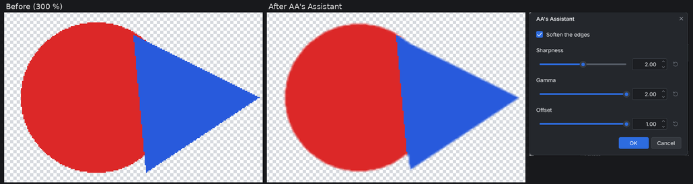

# AA's Assistant (paint.c effect plugin)

Smooths the jagged edge of a cut-out object so it blends into any
background, and doubles as a simple alpha curve. It adds
**Effects > Object > AA's Assistant...** to paint.c.

Typical use: cut an object out with the Magic Wand and delete the
background, then run AA's Assistant on the layer. Only transparency changes:
the hard, stair-stepped rim becomes a soft edge and the fringe of leftover
background color is trimmed by about a pixel. With **Soften the edges**
turned off it reshapes the alpha of every pixel without blurring, for
example to tighten the edge after Feather. The canvas shows a live preview,
and OK adds one History item named "AA's Assistant".

## Controls

| Control | What it does |
|---|---|
| Soften the edges | Averages each pixel's alpha with its 20 nearest neighbors (the 5 x 5 block without its corners, weighted toward the center) before the curve |
| Sharpness | Slope of the alpha curve, 1 to 3: higher gives a harder edge |
| Gamma | Bends the curve, 0.5 to 2: higher pulls partly transparent pixels toward clear |
| Offset | Moves the curve to the right, 0 to 1: higher trims more of the rim |

The curve maps the (averaged) alpha x from 0 to 1 to
`clamp(Sharpness * (x - Offset * (1 - 1 / Sharpness)), 0, 1) ^ Gamma`.
Sharpness 1, Gamma 1 and Offset 0 with Soften off leave the layer unchanged.
Opaque areas stay opaque and the canvas border is never eaten into (pixels
outside the layer count as copies of the border). A pixel that was fully
transparent and becomes visible takes the average color of its visible
neighbors, so no stray color of a transparent pixel shows. It works inside a
selection too; neighbors outside it are still read.

## Install

1. Build it (`cmake --build build --target plugins`) or download the
   `aa_assistant` folder.
2. Copy the whole `aa_assistant` folder (it holds `aa_assistant.so`,
   `aa_assistant.dll` or `aa_assistant.dylib` and this README) into a
   paint.c plugins folder:
   * Linux: `~/.local/share/paintc/plugins/`
   * Windows: `%APPDATA%\paintc\plugins\`
   * macOS: `~/Library/Application Support/paint.c/plugins/`
   * or a `plugins` folder next to the paintc executable (portable installs)
3. Restart paint.c. Problems loading it are listed under
   Effects > Plugin Errors...

Remove the folder to uninstall it. `paintc --disable-plugins` starts without
any plugin.

## Credits and license

The design (softening jagged object edges by a weighted average of 21 alpha
values, then shaping alpha with Sharpness, Gamma and Offset) comes from the
Paint.NET plugin **AA's Assistant by dpy** (part of dpy's Plugin Pack), who
credits **Boude** for the idea. This is an independent clean-room
reimplementation for paint.c, written from dpy's published explanation page
(the kernel weights and the curve graphs); no code, binaries or assets were
taken from it. The original is freeware without published source, and
nothing of it is included here. paint.c is not affiliated with Paint.NET or
with the original authors.

Original plugin: <https://forums.paint.net/topic/16643-dpys-plugin-pack-2014-05-04/>
and dpy's page <http://paintnet.web.fc2.com/plugin/dpy/aaassistant.htm>

Source: `plugins/aa_assistant/fxm_aa_assistant.c` in the paint.c repository,
MIT license like the rest of paint.c. Tests:
`tests/plugins/test_plg_aa_assistant.c`.
