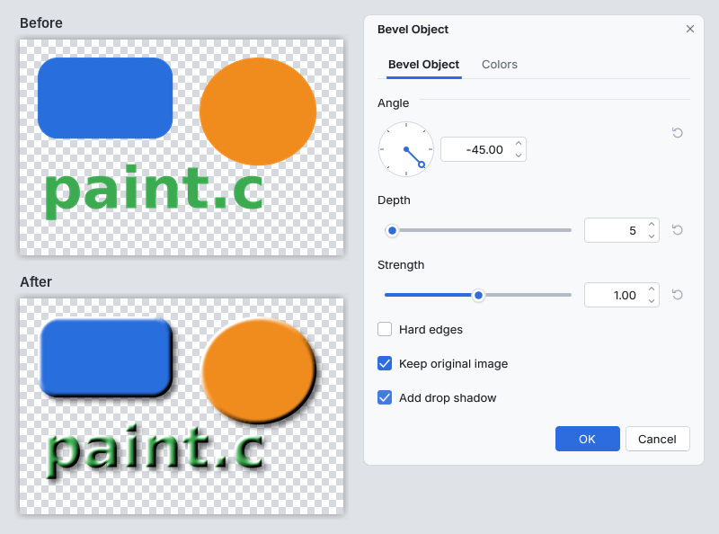

# Bevel Object (paint.c effect plugin)

Gives an object on a transparent layer (text, shapes, cut-outs) a raised,
lit edge: a highlight on the side facing the light and a shadow on the far
side, fading into the flat top. It adds **Effects > Object > Bevel
Object...** to paint.c.

The object is every visible pixel of the active layer inside the selection,
or on the whole canvas when nothing is selected. On an opaque layer, select
a shape first and the selection's edge is bevelled instead (what Bevel
Selection did); with nothing selected, the canvas border is the edge and the
whole image becomes a button.

*The image above: shapes and text on a transparent layer, default settings
with Add drop shadow turned on.*

## Controls

| Control | What it does |
|---|---|
| Angle | The direction the shadow falls, in degrees (0 = right, counter-clockwise; -45, the default, means light from the top left) |
| Depth | Width of the bevel in pixels, 1 to 100 |
| Strength | How strong the light and the shadow are, 0.00 to 2.00 (0 leaves the image unchanged) |
| Hard edges | A straight chamfer with a crisp crease instead of a rounded edge |
| Keep original image | On: the object keeps its colors and gets lighter toward the light color and darker toward the dark color. Off: only the bevel's light and shadow remain (as the light and dark colors with matching transparency), ready to blend onto the object from a layer of its own |
| Add drop shadow | Adds a soft shadow in the dark color behind the object, offset by Depth pixels along Angle. For larger, adjustable shadows use Effects > Object > Drop Shadow |
| Light color (Colors tab) | Color of the lit side, white by default |
| Dark color (Colors tab) | Color of the shaded side and of the drop shadow, black by default |

Partly transparent edge pixels (antialiasing) are lit together with the
edge, so no halo remains. When there is nothing to bevel (no visible pixel in
the selection or on the canvas), a message says so and the image stays as it
was. The same happens, with a hint to select a part, for an object larger
than about 64 million pixels (8000 x 8000) including the bevel's margin.
The result is one History item named "Bevel Object" and the canvas shows a
live preview while you change the settings.

How it works, for the curious: the distance of every pixel to the object's
edge (with subpixel accuracy from the edge's antialiasing) becomes a height
field that rises from the edge to the flat top over Depth pixels, either as
a straight ramp (hard) or a rounded curve (soft), smoothed slightly. Each
pixel is then lit by a directional light from the slope of that height
field.

## Install

1. Build it (`cmake --build build --target plugins`) or download the
   `bevel_object` folder.
2. Copy the whole `bevel_object` folder (it holds `bevel_object.so`,
   `bevel_object.dll` or `bevel_object.dylib` and this README) into a
   paint.c plugins folder:
   * Linux: `~/.local/share/paintc/plugins/`
   * Windows: `%APPDATA%\paintc\plugins\`
   * macOS: `~/Library/Application Support/paint.c/plugins/`
   * or a `plugins` folder next to the paintc executable (portable installs)
3. Restart paint.c. Problems loading it are listed under
   Effects > Plugin Errors...

Remove the folder to uninstall it. `paintc --disable-plugins` starts without
any plugin.

## Credits

The design (a lit bevel along the edge of an object or selection, with light
angle, depth, strength, hard edges, keep original and drop shadow options
and light and dark colors) comes from the Paint.NET plugins **Bevel Object**
and **Bevel Selection** by **BoltBait** (Bevel Selection with **Ed
Harvey**), part of BoltBait's Plugin Pack. Thank you both.

## License

This is an independent clean-room reimplementation for paint.c, written from
the plugins' public descriptions and screenshots; no code, binaries or
assets were taken from them. The height field uses a standard Euclidean
distance transform (Felzenszwalb and Huttenlocher) following paint.c's own
`src/fx/object/fx2_field.c`. paint.c is not affiliated with Paint.NET or
with the original authors.

Source: `plugins/bevel_object/fxm_bevel_object.c` in the paint.c repository,
MIT license like the rest of paint.c. Tests:
`tests/plugins/test_plg_bevel_object.c`.
