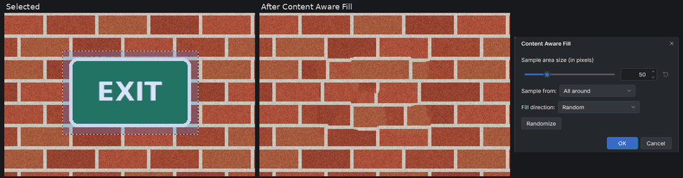

# Content Aware Fill (paint.c effect plugin)

Removes an object or a blemish: the selected pixels are replaced by texture
synthesized from the unselected surroundings, so the area blends in. It adds
**Effects > Selection > Content Aware Fill...** to paint.c.

Select the thing to remove (a little larger than it, any selection tool),
then run the effect. The fill copies pixels from a band around the
selection, choosing for every pixel the place whose neighborhood matches
best, so lines, edges and textures continue into the hole. Antialiased
selection edges blend the fill with the original. The canvas shows a live
preview, and OK adds one History item named "Content Aware Fill".

## Controls

| Control | What it does |
|---|---|
| Sample area size (in pixels) | Width of the band around the selection that the fill copies from, 1 to 200 |
| Sample from | All around, Sides (left and right of the selection only) or Top and bottom (above and below only). Unselected holes inside the selection are always used |
| Fill direction | The order of the first pass: Random, Inwards towards center (edge first) or Outwards from center |
| Randomize | Tries another random fill; the same value always gives the same result |

Pixels selected at 50 % or more are filled. Transparent surroundings fill
with transparency.

When there is nothing to do a message says why and the image stays as it
was:

* nothing is selected;
* there is no unselected area to sample from (the whole image is selected,
  or a full-width selection with Sample from: Sides).

The selection may touch the image edge as long as some unselected pixels
remain. Large selections take longer (all the work happens before the
preview appears); the result does not depend on the number of threads.

## How it works

The fill follows Paul Harrison's texture resynthesis: pixels are visited in
the chosen order; each one compares the 30 nearest known pixels around it
with the same pattern around candidate places in the band (the places that
continue its already filled neighbors, then up to 500 random places), using
a robust color distance, and copies the best match. Five refinement passes
revisit the fill from the edge inward, trusting the real surroundings more
than earlier guesses. For larger selections paint.c first works on smaller
copies of the image (so bricks, planks and other large patterns line up) and
then refines each finer copy from the coarser result.

## Install

1. Build it (`cmake --build build --target plugins`) or download the
   `content_aware_fill` folder.
2. Copy the whole `content_aware_fill` folder (it holds
   `content_aware_fill.so`, `content_aware_fill.dll` or
   `content_aware_fill.dylib` and this README) into a paint.c plugins folder:
   * Linux: `~/.local/share/paintc/plugins/`
   * Windows: `%APPDATA%\paintc\plugins\`
   * macOS: `~/Library/Application Support/paint.c/plugins/`
   * or a `plugins` folder next to the paintc executable (portable installs)
3. Restart paint.c. Problems loading it are listed under
   Effects > Plugin Errors...

Remove the folder to uninstall it. `paintc --disable-plugins` starts without
any plugin.

## Credits and license

The design (filling a selection with texture matched from a band around it,
with sample size, sample sides, fill direction and seed) comes from the
Paint.NET plugin **Content Aware Fill by null54** (Nicholas Hayes), which
builds on the GIMP **Resynthesizer** by **Lloyd Konneker** and **Paul
Harrison**'s texture resynthesis research. This is an independent clean-room
implementation for paint.c, written from published research papers
(P. Harrison, "A non-hierarchical procedure for re-synthesis of complex
textures", WSCG 2001, and his 2005 thesis "Image Texture Tools"; C. Barnes
et al., "PatchMatch", SIGGRAPH 2009, for the local search on finer levels)
and the plugin's public description. Content Aware Fill (GPL-2.0) and
Resynthesizer (GPL-3.0) are open source, but no code from either was read or
used. paint.c is not affiliated with Paint.NET or with the original authors.

Original plugin: <https://forums.paint.net/topic/112730-content-aware-fill-2025-03-06/>

Source: `plugins/content_aware_fill/fxm_content_aware_fill.c` in the paint.c
repository, MIT license like the rest of paint.c. Tests:
`tests/plugins/test_plg_content_aware_fill.c`.
