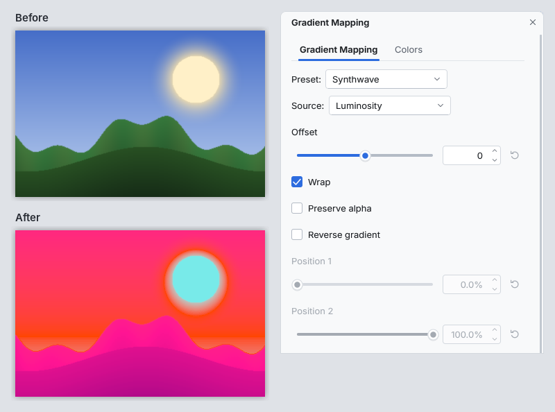

# Gradient Mapping (paint.c adjustment plugin)

Recolors an image by looking up each pixel's value in one channel
(luminosity, a color channel, CMYK, hue, saturation, value or alpha) in a
multi-color gradient. It adds **Adjustments > Gradient Mapping...** to
paint.c.

Use it for duotones and sepia, false color and thermal looks, posterized
grays, or to make multicolor gradients: draw a black to white gradient with
the Gradient tool, then map it.

*The image above: a landscape mapped through the Synthwave preset from its
luminosity.*

## Controls

| Control | What it does |
|---|---|
| Preset | A built-in gradient: Rainbow, High Contrast, Hot, Synthwave, Sepia, Duotone Blue, Thermal, Cyanotype, Posterize Grays, Cotton Candy, Toxic, Fire or Vaporwave. Custom uses the colors below |
| Source | The channel whose value (0 to 255) picks the color: Alpha, Red, Green, Blue, Cyan, Magenta, Yellow, Key / Black, Hue, Saturation, Value / Brightness or Luminosity (the default) |
| Offset | Shifts the value before the lookup, -255 to 255 |
| Wrap | Values shifted past either end wrap around to the other end (on by default); off, they stop at the end |
| Preserve alpha | Keeps each pixel's transparency instead of taking the gradient's |
| Reverse gradient | Mirrors the gradient end to end |
| Color 1 and 2, Position 1 and 2 | The custom gradient's two main stops: black at 0 % and white at 100 % by default |
| Use color 3 to 8, Color 3 to 8, Position 3 to 8 | Up to six more stops; tick Use to add one |

The colors are on the dialog's Colors tab; every stop color can be partly
transparent. Stops may be in any order (they are sorted by position), and
between two stops the colors blend in linear light, so a black to white
gradient maps middle gray to a lighter gray than a plain average would.
Before the first stop and after the last, the end colors continue. The
adjustment works on the selection when there is one and on the whole layer
otherwise.

Differences from the original plugin: its gradient editor (click to add a
stop, drag, Spread, Clear, saved user presets) becomes up to eight stops of
plain controls, its Reverse command is the Reverse gradient check box, and
choosing a preset does not reset Source, Offset, Wrap and Preserve alpha.

## Install

1. Build it (`cmake --build build --target plugins`) or download the
   `gradient_mapping` folder.
2. Copy the whole `gradient_mapping` folder (it holds `gradient_mapping.so`,
   `gradient_mapping.dll` or `gradient_mapping.dylib`, this README and
   `LICENSE-original.txt`) into a paint.c plugins folder:
   * Linux: `~/.local/share/paintc/plugins/`
   * Windows: `%APPDATA%\paintc\plugins\`
   * macOS: `~/Library/Application Support/paint.c/plugins/`
   * or a `plugins` folder next to the paintc executable (portable installs)
3. Restart paint.c. Problems loading it are listed under
   Effects > Plugin Errors...

Remove the folder to uninstall it. `paintc --disable-plugins` starts without
any plugin.

## Credits

Gradient Mapping is based on the Paint.NET plugin of the same name by
**pyrochild** (Zach Walker), part of the pyrochild plugin pack. Thank you!

## License

Parts of the original plugin's logic were ported to C for paint.c from its
source code, which pyrochild published under the MIT license
(https://github.com/bsneeze/pdn-gradientmapping, commit 95a2e4dc): the
gradient lookup, the channel values (including the original's integer
division, so hues match it exactly), the lookup table and the presets.
Copyright (c) 2007, 2016 Zach Walker; the license text is in
`LICENSE-original.txt` next to this file. The blend between two stops is
written fresh from the sRGB transfer function; no icons, resources or other
files of the original were used. paint.c is not affiliated with Paint.NET or
with the original author.

Source: `plugins/gradient_mapping/fxm_gradient_mapping.c` in the paint.c
repository, MIT license like the rest of paint.c. Tests:
`tests/plugins/test_plg_gradient_mapping.c`.
