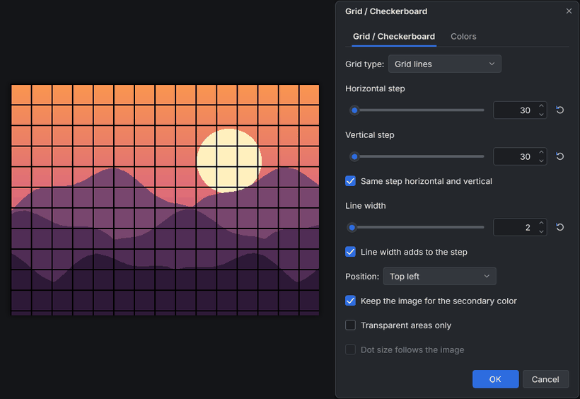

<!-- paintc-plugin
name: Grid / Checkerboard
version: 1.0.0
menu: Effects > Render > Grid / Checkerboard
summary: Draws a grid of lines, a checkerboard or a grid of dots with any cell size, line width and two colors with alpha.
original: Grid Maker by BoltBait and Illnab1024, and Grid & Checker Maker by MadJik
original-url: https://forums.paint.net/topic/1964-grid-maker-plugin-v30-updated-july-2-2014/
basis: clean room
-->
# Grid / Checkerboard (paint.c effect plugin)

Draws a grid of lines, a checkerboard or a grid of dots over the selection
(or the whole canvas), with any cell size, line width and two colors with
alpha. It adds **Effects > Render > Grid / Checkerboard...** to paint.c.

Use it for pixel art guides, map and board grids, transparency checkers,
backgrounds, tartan patterns or a halftone look.

## Controls

| Control | What it does |
|---|---|
| Grid type | **Grid lines**, **Checkerboard** or **Dots** (one round dot per cell) |
| Horizontal step, Vertical step | Cell size in pixels, 1 to 1000 (default 20) |
| Same step horizontal and vertical | Keeps both steps equal while it is on: changing one changes the other |
| Line width | 1 to 100 pixels (default 1). With Dots it is the gap between the dots |
| Line width adds to the step | On (default): the step is the space between two lines, so the pattern repeats every step + line width pixels. Off: lines repeat every step pixels |
| Position | Where the pattern starts: **Top left** (a line on the left and top edges), **Centered on lines** (a line through the center), **Centered on cells** (a cell in the center), **Bottom right** (a line on the right and bottom edges) |
| Primary color (Colors tab) | Lines, the dark checkerboard squares and the dots. Starts as the palette's primary color; alpha is supported |
| Secondary color (Colors tab) | Everything else. Starts as the palette's secondary color |
| Keep the image for the secondary color | Only the primary parts are drawn; the image stays visible between them. A primary color with alpha below 255 tints the image instead of covering it |
| Transparent areas only | The pattern goes behind the image: it only shows where the layer is transparent or translucent |
| Dot size follows the image | Dots only: each dot's size follows the brightness under it, big in dark areas and small in light ones (a halftone) |

Details:

* The pattern is anchored to the selection's bounding box, so it starts at
  the selection's corner, not at the canvas corner. Outside the selection
  nothing changes, and antialiased selection edges blend smoothly.
* With the checkerboard the top left square is primary, and with Bottom
  right the bottom right square is primary. Centered on lines puts a
  corner of four squares on the center.
* Dots are antialiased. Their diameter is the smaller step minus the gap.
* A color with alpha 0 erases (or, with Keep the image, leaves the image
  as it is).

## Install

1. Build it (`cmake --build build --target plugins`) or download the
   `grid_checkerboard` folder.
2. Copy the whole `grid_checkerboard` folder (it holds
   `grid_checkerboard.so`, `grid_checkerboard.dll` or
   `grid_checkerboard.dylib` and this README) into a paint.c plugins folder:
   * Linux: `~/.local/share/paintc/plugins/`
   * Windows: `%APPDATA%\paintc\plugins\`
   * macOS: `~/Library/Application Support/paint.c/plugins/`
   * or a `plugins` folder next to the paintc executable (portable installs)
3. Restart paint.c. Problems loading it are listed under
   Effects > Plugin Errors...

Remove the folder to uninstall it. `paintc --disable-plugins` starts without
any plugin.

## Credits and license

The design (grid lines, checkerboards and dots with a cell size, line
width, two colors, anchoring and the keep-image and transparent-only
options) comes from the Paint.NET plugins Grid Maker by **BoltBait** and
**Illnab1024** (now Grid / Checkerboard in BoltBait's plugin pack) and Grid &
Checker Maker by **MadJik**. This is an independent clean-room
reimplementation for paint.c, written from their published descriptions and
screenshots; no code, binaries or assets were taken from them. paint.c is
not affiliated with Paint.NET or with the original authors.

Sources used for the design:
[Grid Maker by BoltBait and Illnab1024](https://forums.paint.net/topic/1964-grid-maker-plugin-v30-updated-july-2-2014/)
and [Grid & Checker Maker by MadJik](https://forums.paint.net/topic/4175-grid-maker-plugin/)
on the Paint.NET forum.

Source: `plugins/grid_checkerboard/fxm_grid_checkerboard.c` in the paint.c
repository, MIT license like the rest of paint.c. Tests:
`tests/plugins/test_plg_grid_checkerboard.c`.
