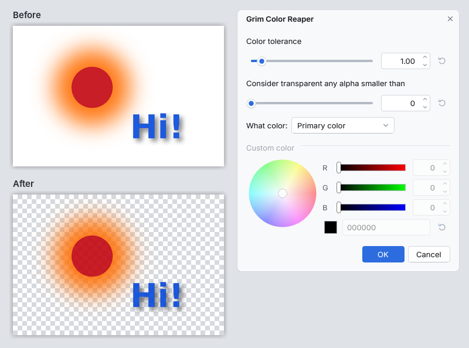

<!-- paintc-plugin
name: Grim Color Reaper
version: 1.0.0
menu: Effects > Color > Grim Color Reaper
summary: Removes a background color and recovers what was blended with it, so soft edges, glows and shadows become partly transparent without a halo.
original: Grim Color Reaper by Jotaf, continued as Kill Color Keeper by Pratyush
original-url: https://forums.paint.net/topic/15595-grim-color-reaper-plugin/
basis: clean room
-->
# Grim Color Reaper (paint.c effect plugin)

Removes a background color from an image and recovers what was blended with
it. It adds **Effects > Color > Grim Color Reaper...** to paint.c.

Every pixel gets the smallest opacity that explains it as some color laid
over the background color, and its color is corrected to that color. Soft
edges, glows, antialiased text and shadows keep their shape and become
partly transparent, without the halo of the old background that a magic
wand or a plain "color to transparent" leaves behind. Typical uses: lifting
a logo, a scan or a drawing off a white page, or a glow off black.

*The image above: a glow and text with a soft shadow on white, with the
primary color set to white and the default settings. The glow and the shadow
stay as semi-transparent orange and gray over the transparent checkerboard.*

## Controls

| Control | What it does |
|---|---|
| Color tolerance | 1.00 removes exactly the background color and recovers the rest. Higher values also remove colors close to the background (noise, JPEG fringes, faint shadows); a pixel that is entirely unlike the background stays opaque. Lower values keep more of the near-background colors. Range 0.10 to 10.00 |
| Consider transparent any alpha smaller than | Pixels whose recovered opacity (0 to 255) is below this become fully transparent; it cleans up small patches of nearly invisible pixels. 0 keeps everything |
| What color | The background color to remove: the primary color, the secondary color, black, white, or a custom color |
| Custom color | The color removed when What color is Custom |

The background color's own transparency is ignored. Pixels that were already
partly transparent stay at most as opaque as they were. The effect works on
the selection when there is one (antialiased selection edges blend as with
every effect) and on the whole layer otherwise.

How it works, for the curious: a pixel C that was made by laying a color F
with opacity a over the background K satisfies C = a F + (1 - a) K. For each
channel the smallest a that keeps F between 0 and 255 is found, the largest
of the three is the pixel's opacity, and F = K + (C - K) / a is its
recovered color (the classic "un-blend" of blue screen matting). The
tolerance raises that opacity to the given power.

## Install

1. Build it (`cmake --build build --target plugins`) or download the
   `grim_color_reaper` folder.
2. Copy the whole `grim_color_reaper` folder (it holds
   `grim_color_reaper.so`, `grim_color_reaper.dll` or
   `grim_color_reaper.dylib` and this README) into a paint.c plugins folder:
   * Linux: `~/.local/share/paintc/plugins/`
   * Windows: `%APPDATA%\paintc\plugins\`
   * macOS: `~/Library/Application Support/paint.c/plugins/`
   * or a `plugins` folder next to the paintc executable (portable installs)
3. Restart paint.c. Problems loading it are listed under
   Effects > Plugin Errors...

Remove the folder to uninstall it. `paintc --disable-plugins` starts without
any plugin.

## Credits

The design (removing a color by recovering each pixel's alpha and its
original color, the color tolerance, the alpha cut-off and the color
choices) comes from the Paint.NET plugin **Grim Color Reaper** (first named
"Kill Color") by **Jotaf**, continued as **Kill Color Keeper** by
**Pratyush**. Thank you both.

Original plugins: Grim Color Reaper
<https://forums.paint.net/topic/15595-grim-color-reaper-plugin/>
and Kill Color Keeper <https://forums.paint.net/topic/112400-kill-color-keeper-v-12/>

## License

This is an independent clean-room reimplementation for paint.c, written from
the plugins' public descriptions and dialogs and the standard un-blend
formula; no code, binaries or assets were taken from those plugins. paint.c
is not affiliated with Paint.NET or with the original authors.

Source: `plugins/grim_color_reaper/fxm_grim_color_reaper.c` in the paint.c
repository, MIT license like the rest of paint.c. Tests:
`tests/plugins/test_plg_grim_color_reaper.c`.
