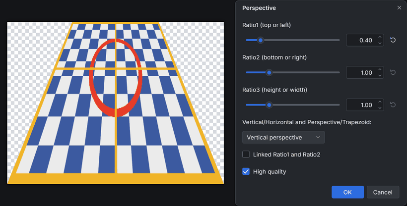

<!-- paintc-plugin
name: Perspective
version: 1.0.0
menu: Effects > Distort > Perspective
summary: Keystone and perspective transforms set by three ratios, vertical or horizontal, as a true perspective or a plain trapezoid.
original: Perspective by dpy
original-url: https://forums.paint.net/topic/16197-perspective-effect-v20-update-030510/
basis: clean room
-->
# Perspective (paint.c effect plugin)

Keystone and perspective transforms set by three numbers: narrow or widen
one edge of the selection relative to the opposite edge and change its
height (or width), either as a true perspective, where rows crowd toward
the far edge, or as a plain trapezoid. It adds
**Effects > Distort > Perspective...** to paint.c.

Use it to lay an image onto a floor or a wall, or to correct converging
verticals in a photo.

## Controls

| Control | Range (default) | What it does |
|---|---|---|
| Ratio1 (top or left) | 0.01 to 16 (1.00) | Width of the top edge (vertical modes) or height of the left edge (horizontal modes), relative to the selection |
| Ratio2 (bottom or right) | 0.01 to 16 (1.00) | Width of the bottom edge or height of the right edge |
| Ratio3 (height or width) | 0.01 to 16 (1.00) | Height of the result measured from the top (vertical modes) or its width measured from the left (horizontal modes) |
| Vertical/Horizontal and Perspective/Trapezoid | Vertical perspective | **Vertical perspective**, **Vertical trapezoid**, **Horizontal perspective** or **Horizontal trapezoid**. Perspective compresses the rows toward the narrower edge, like a floor going into the distance; Trapezoid keeps them evenly spaced |
| Linked Ratio1 and Ratio2 | off | Ratio1 and Ratio2 keep the same value (a plain stretch) |
| High quality | on | Smooth, antialiased sampling; off uses the nearest pixel, which is faster |

Details:

* The edges stay centered: in vertical modes the top and bottom edges are
  centered horizontally, in horizontal modes the left and right edges are
  centered vertically.
* Parts that would fall outside the selection's bounding box are cut off;
  pixels of the selection the image no longer covers become transparent.
* Ratios of 1.00 leave the image as it is (with High quality off the
  result is identical; High quality resamples slightly).
* With High quality on, strongly shrunk rows are sampled more densely, so
  fine patterns turn smooth instead of flickering.

## Install

1. Build it (`cmake --build build --target plugins`) or download the
   `perspective` folder.
2. Copy the whole `perspective` folder (it holds `perspective.so`,
   `perspective.dll` or `perspective.dylib` and this README) into a paint.c
   plugins folder:
   * Linux: `~/.local/share/paintc/plugins/`
   * Windows: `%APPDATA%\paintc\plugins\`
   * macOS: `~/Library/Application Support/paint.c/plugins/`
   * or a `plugins` folder next to the paintc executable (portable installs)
3. Restart paint.c. Problems loading it are listed under
   Effects > Plugin Errors...

Remove the folder to uninstall it. `paintc --disable-plugins` starts without
any plugin.

## Credits and license

The design (perspective and trapezoid transforms set by three ratios,
vertical or horizontal, linked ratios and a quality switch) comes from the
Paint.NET plugin Perspective by **dpy**. This is an independent clean-room
reimplementation for paint.c, written from dpy's published description and
diagrams; no code, binaries or assets were taken from it. paint.c is not
affiliated with Paint.NET or with the original authors. One difference:
with Linked on, the original ignored Ratio2; here Ratio2 follows Ratio1 in
the dialog.

Source used for the design:
[Perspective Effect by dpy](https://forums.paint.net/topic/16197-perspective-effect-v20-update-030510/)
on the Paint.NET forum.

Source: `plugins/perspective/fxm_perspective.c` in the paint.c repository,
MIT license like the rest of paint.c. Tests:
`tests/plugins/test_plg_perspective.c`.
