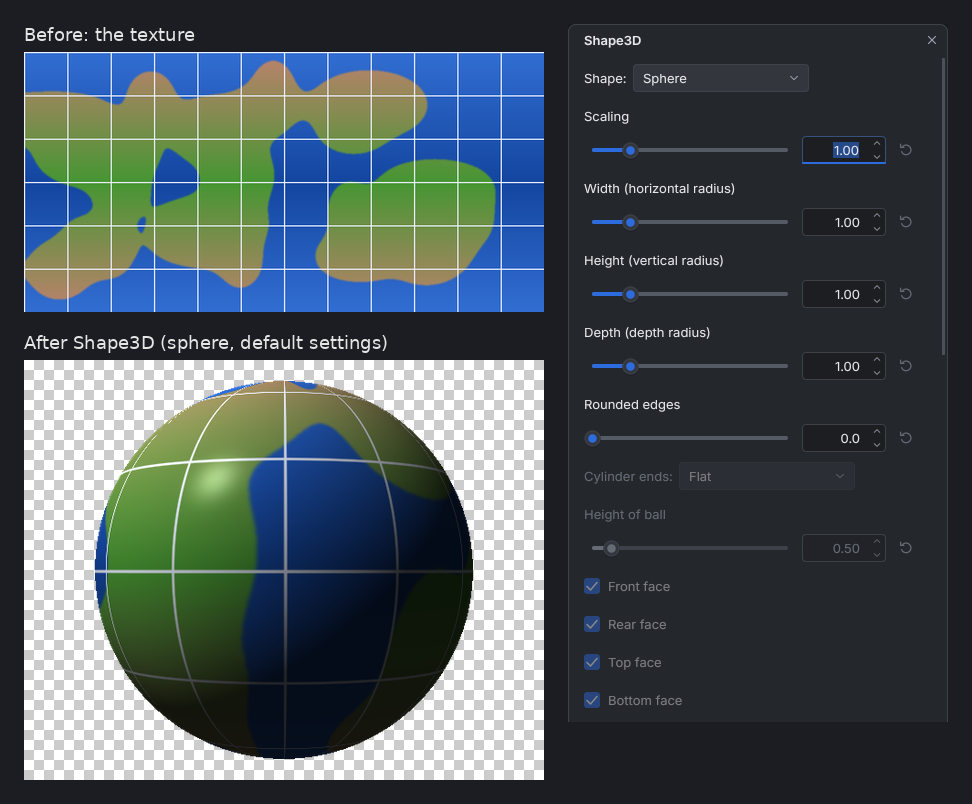

<!-- paintc-plugin
name: Shape3D
version: 1.0.0
menu: Effects > Render > Shape3D
summary: Wraps the image around a 3D sphere, cylinder or box and renders it with a perspective camera, lighting and a highlight.
original: Shape3D by MKT, with later fixes by MJW and toe_head2001
original-url: https://forums.paint.net/topic/18968-shape3d-2007-08-24-bug-fixed-september-2023/
basis: clean room
-->
# Shape3D (paint.c effect plugin)

Wraps the image around a 3D sphere, cylinder or box and renders it with a
perspective camera, lighting and a highlight. It adds
**Effects > Render > Shape3D...** to paint.c.

The texture is the selection (its bounding rectangle) of the active layer, or
the whole layer when nothing is selected. The rendered shape replaces that
area on transparency, ready for a drop shadow or another layer behind it:
globes, buttons, discs, boxes, dice and product shots. The canvas shows a
live preview while you change the settings, and OK adds one History item
named "Shape3D".

## Controls

The dialog is one scrolling column. One **unit** is 45 % of the shorter side
of the selection, so a sphere of radius 1 nearly fills it.

| Control | What it does |
|---|---|
| Shape | Sphere, Cylinder or Box |
| Scaling | Grows or shrinks the whole shape |
| Width, Height, Depth | Half sizes along the shape's own X, Y and Z axes, in units (the radii of the sphere; the radius and half height of the cylinder) |
| Rounded edges | Softens the edges of a box and the rims of a flat-ended cylinder. Only the shading changes, like a bump map, so it shows where light falls |
| Cylinder ends | Open (a tube you can look into), Flat or Ball (a dome on each end) |
| Height of ball | How far each dome reaches, in units |
| Front, Rear, Top, Bottom, Left, Right face | The faces of the box; a face turned off leaves the box open |
| Texture map | How the image is laid onto the surface (table below) |
| Texture scale | Size of the image for Plane map (scalable) |
| Texture rotate | Turns the image clockwise by 0, 90, 180 or 270 degrees first |
| Rotation 1, 2, 3 | Three turns applied in order, each about the X (right), Y (up) or Z (toward you) axis, counter-clockwise when you look down the axis |
| Pan | Moves the shape; the pad shows the selection |
| Camera angle | Field of view. Wider angles bring the camera closer and strengthen the perspective; the shape keeps its size through its center |
| Antialiasing, level | Level n traces (n + 1) x (n + 1) rays per pixel for smooth outlines |
| Transparency, Alpha channel | Makes the front see-through, so the lit inside of the back shows |
| Lighting | Off shows the plain texture |
| Strength of light, Light direction X, Y, Z, Light color | A parallel light coming from the given direction (0, 0, 0 means from the viewer) |
| Ambient lighting, Diffuse reflection rate | Base brightness and the strength of the matte shading |
| Specular highlight, Specular reflection rate | The shiny spot and its strength |
| Specular model | Phong (Phong size: larger is a smaller, sharper spot) or Cook-Torrance (Refractive index; Luster Isotropy with Roughness, or Anisotropy with Roughness X along the image's horizontal direction and Roughness Y across it) |

Every map works on every shape:

| Texture map | Layout |
|---|---|
| Full sphere map | The image once around, top edge at the north pole |
| Half sphere map | The image over the upper half; the lower half stays open (a bowl) |
| Half sphere map (repeat) | The lower half shows the image mirrored |
| Full cylinder map | Once around, top to bottom along the surface, ends included |
| Half cylinder map | The image over the front half; the back stays open |
| Half cylinder map (repeat) | The back half shows the image mirrored |
| Plane map | Projected from the front (mirrored on the back) |
| Plane map (scalable) | The same at Texture scale; transparent outside the image |
| Cube map | The whole image on every face |
| Dice map | The image is a 4 x 3 net: the middle row is left, front, right, rear; the top sits above and the bottom below the front |
| Dice map (float) | The same net with the cells sized by the box's width, height and depth, so long boxes keep their faces in proportion |

Transparent parts of the image are holes in the shape. Rendering is the same
for any number of threads and preview tiles.

Compared with the original: paint.c's dialog is a single column, so the
three shape tabs became the Shape choice with shared size boxes, the
cylinder maps "with ends" and "no ends" became Cylinder ends Flat or Open,
and the Reset buttons, XML load and save and the rotation step buttons map
to paint.c's reset buttons, presets and the angle dial (Shift snaps it to
15 degrees). Where the original's manual gives no number (the size of a
unit, the width of a rounded edge, some ranges), paint.c chose one.

## Install

1. Build it (`cmake --build build --target plugins`) or download the
   `shape3d` folder.
2. Copy the whole `shape3d` folder (it holds `shape3d.so`, `shape3d.dll` or
   `shape3d.dylib` and this README) into a paint.c plugins folder:
   * Linux: `~/.local/share/paintc/plugins/`
   * Windows: `%APPDATA%\paintc\plugins\`
   * macOS: `~/Library/Application Support/paint.c/plugins/`
   * or a `plugins` folder next to the paintc executable (portable installs)
3. Restart paint.c. Problems loading it are listed under
   Effects > Plugin Errors...

Remove the folder to uninstall it. `paintc --disable-plugins` starts without
any plugin.

## Credits and license

The design (the three primitives, the texture maps including the dice maps,
the three-axis rotation, camera angle, Lambert lighting, Phong and
Cook-Torrance highlights, see-through rendering and the antialiasing levels)
comes from the Paint.NET plugin **Shape3D by MKT**, with later fixes by
**MJW** and **toe_head2001**. This is an independent clean-room
reimplementation for paint.c, written from the plugin's public manual, forum
posts and dialog screenshots; no code, binaries or assets were taken from it.
The original is freeware without published source, and nothing of it is
included here. paint.c is not affiliated with Paint.NET or with the original
authors.

Original plugin: <https://forums.paint.net/topic/18968-shape3d-2007-08-24-bug-fixed-september-2023/>

Source: `plugins/shape3d/fxm_shape3d.c` in the paint.c repository, MIT
license like the rest of paint.c. Tests: `tests/plugins/test_plg_shape3d.c`.
