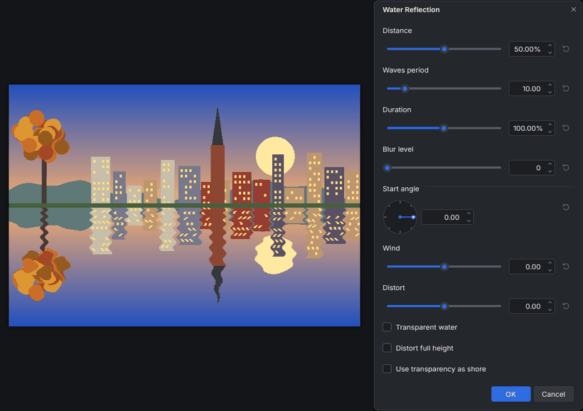

# Water Reflection (paint.c effect plugin)

Turns the lower part of the selection (or the canvas) into a rippled mirror
image of what is above a waterline, like a lake reflecting a skyline. It
adds **Effects > Distort > Water Reflection...** to paint.c.

## Controls

| Control | Range (default) | What it does |
|---|---|---|
| Distance | 0 to 100 % (50 %) | Where the water starts, in percent of the selection's height from its top. 100 % leaves the image unchanged; 0 % makes everything water |
| Waves period | 0.01 to 400 (10) | The size of the ripples: roughly their wavelength in pixels near the waterline, and how far they push the reflection sideways. Ripples grow toward the bottom, as on real water seen in perspective |
| Duration | 0.01 to 200 % (100 %) | How far down the waves reach before the water is calm. At 100 % they fade out exactly at the bottom, at 200 % half of their strength is left there, small values calm the water right below the waterline |
| Blur level | 0 to 10 (0) | Softens the reflection (a Gaussian blur done inside the effect); the image above the waterline stays sharp |
| Start angle | -180 to 180 (0) | Shifts the phase of the waves, which changes their look; 180 flips them |
| Wind | -100 to 100 (0) | Adds a slow, smooth sideways wobble that varies across the width |
| Distort | -100 to 100 (0) | Adds a strong distortion by stretching and squeezing the reflected rows |
| Transparent water | off | The reflection fades from opaque at the waterline to almost transparent at the bottom |
| Distort full height | off | The waves also distort the image above the waterline (not mirrored) |
| Use transparency as shore | off | The water follows a shoreline you cut out: erase the area below the shore (top = image, bottom = transparent) and each column starts its water right below the lowest opaque pixel. A smooth cut gives the best result |

Details:

* The reflection is the image above the waterline mirrored about it; rows
  of water deeper than the image above them repeat its top row.
* A transparent layer reflects as transparent too. To reflect text or an
  object on its own layer, flatten first or put a background under it.
* Columns that are fully transparent, or opaque down to the bottom, use the
  Distance waterline when "Use transparency as shore" is on.
* The selection's bounding box is the work area; outside the selection
  nothing changes.

## Install

1. Build it (`cmake --build build --target plugins`) or download the
   `water_reflection` folder.
2. Copy the whole `water_reflection` folder (it holds
   `water_reflection.so`, `water_reflection.dll` or `water_reflection.dylib`
   and this README) into a paint.c plugins folder:
   * Linux: `~/.local/share/paintc/plugins/`
   * Windows: `%APPDATA%\paintc\plugins\`
   * macOS: `~/Library/Application Support/paint.c/plugins/`
   * or a `plugins` folder next to the paintc executable (portable installs)
3. Restart paint.c. Problems loading it are listed under
   Effects > Plugin Errors...

Remove the folder to uninstall it. `paintc --disable-plugins` starts without
any plugin.

## Credits and license

The design (a rippled reflection below a waterline with distance, wave
period, duration, blur, start angle, wind, distort, transparent water, full
height distortion and transparency as shoreline) comes from the Paint.NET
plugin Water Reflection by **MadJik**, based on Tom Jackson's reflection
script. This is an independent clean-room reimplementation for paint.c,
written from MadJik's published description of the controls; no code,
binaries or assets were taken from it. The exact formulas of the original
are not public, so the wave model is paint.c's own and the result looks
similar, not identical. paint.c is not affiliated with Paint.NET or with
the original authors.

Source used for the design:
[Water Reflection by MadJik](https://forums.paint.net/topic/2482-water-reflection-ymd100725/)
on the Paint.NET forum.

Source: `plugins/water_reflection/fxm_water_reflection.c` in the paint.c
repository, MIT license like the rest of paint.c. Tests:
`tests/plugins/test_plg_water_reflection.c`.
